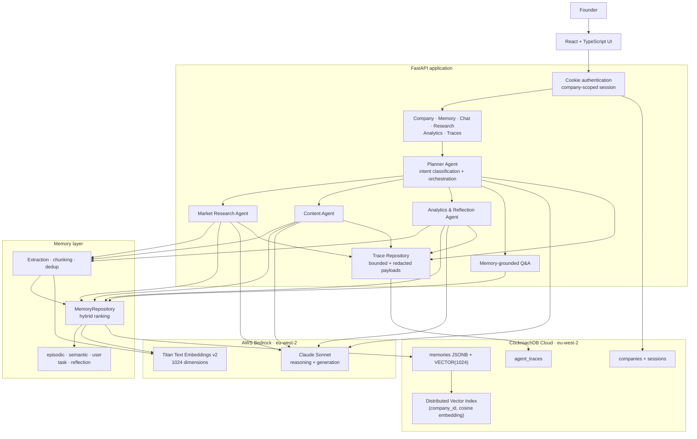

<div align="center">

# GrowthPilot

### A memory-first AI go-to-market teammate for early-stage founders

**Research → create → measure → reflect → remember → improve**

Built for the **CockroachDB × AWS AI Agent Hackathon 2026**


</div>

## Why GrowthPilot?

Founders repeatedly explain the same company context to disconnected tools:
their ideal customer, positioning, previous experiments, research, and what
worked last week. Conventional AI generation produces another isolated answer.

GrowthPilot turns that history into durable company memory. Specialized agents
retrieve relevant context before acting, persist useful results afterwards, and
make their memory provenance visible. A later content run can therefore use a
reflection learned from an earlier campaign instead of starting from scratch.

## The demo loop

1. A founder completes onboarding. Goals, customers, channels, and previous
   attempts become typed memories.
2. The Market Research Agent creates structured, deduplicated research memory.
3. The Planner routes a request to Research, Content, Analytics, or
   memory-grounded Q&A.
4. The Content Agent retrieves company context and produces a campaign asset.
5. The Analytics & Reflection Agent compares simulated LinkedIn performance,
   creates a cautious hypothesis, and saves it as `reflection` memory.
6. The next Content run retrieves that reflection. The UI shows exactly which
   memories were used.

> Campaign likes, comments, and clicks are explicitly simulated for the
> hackathon demo. GrowthPilot does not claim a live LinkedIn integration.

## Architecture

This diagram is the source-of-truth architecture for the hackathon build.



### Memory improvement loop


## What is implemented

| Capability | Implementation |
|---|---|
| Persistent memory | Five typed memory categories stored in CockroachDB |
| Semantic retrieval | Titan embeddings and CockroachDB cosine vector search |
| Hybrid ranking | Similarity combined with recency and importance |
| Tenant isolation | Every memory query is scoped by authenticated `company_id` |
| Onboarding | Company profile plus typed founder memories |
| Planner | Single, parallel, and dependency-aware sequential execution |
| Market Research | Bedrock- or user-source findings, structured and deduplicated |
| Content Generation | Memory-grounded marketing content persisted as task memory |
| Analytics & Reflection | Deterministic comparison plus Bedrock narrative and saved reflection |
| Memory Inspector | Retrieved content, type, similarity, recency, and importance |
| Observability | Per-agent duration, success/error, output, and retrieved-memory traces |
| Authentication | Hashed credentials and secure company-scoped session cookies |
| Resilience | CockroachDB `40001` transaction retry and non-blocking trace failures |

### Honest scope boundary

- Market research is generated from the company profile or user-supplied source
  text; it is not a general-purpose web crawler.
- Analytics uses seeded, simulated LinkedIn performance.
- GrowthGraph synthetic cohort seeding and its privacy-safe frontend contract
  exist. The cross-tenant `POST /api/growthgraph/insights` implementation is a
  separate T36 deliverable and must never expose raw tenant data.
- CRM automation, live social publishing, and autonomous paid campaigns are
  roadmap items, not current capabilities.

## Why CockroachDB?

GrowthPilot needs relational integrity, JSON metadata, tenant-scoped access,
transactional writes, and semantic retrieval in the same durable system.
CockroachDB provides that without adding a separate vector database.

### Distributed Vector Indexing

Memories use `VECTOR(1024)` embeddings and cosine distance. The vector index is
prefixed by `company_id`:

```sql
VECTOR INDEX (company_id, embedding vector_cosine_ops)
```

The prefix both narrows the search space and enforces the query shape used for
tenant isolation. Single-tenant retrieval uses `company_id = $1`; approved
cross-tenant aggregate work must use an explicit `company_id IN (...)`
allowlist, never an unconstrained range.

### Production-minded database behavior

- Full transactions retry on CockroachDB serialization error `40001`.
- Bedrock embedding calls happen outside retried transactions, avoiding repeated
  cost and latency.
- Content hashes provide idempotent memory deduplication.
- JSONB stores typed provenance without fragmenting the memory table.
- Traces are bounded and recursively redact credentials, cookies, and tokens.

More detail is available in [`docs/memory.md`](docs/memory.md).

## Why AWS Bedrock?

GrowthPilot uses AWS Bedrock in `eu-west-2` for two distinct jobs:

- **Titan Text Embeddings v2** creates 1024-dimensional memory embeddings.
- **Claude Sonnet** performs intent classification, research synthesis, content
  generation, and reflection writing.

The Analytics Agent calculates all engagement totals and averages in Python
before asking the model for a narrative. The LLM cannot silently change the
winning group or invent unsupported metrics.

## API surface

| Method | Endpoint | Purpose |
|---|---|---|
| `GET` | `/health` | Service health |
| `POST` | `/api/auth/signup` | Create a company account |
| `POST` | `/api/auth/login` | Start a secure session |
| `POST` | `/api/auth/logout` | End the session |
| `GET` | `/api/company/me` | Current company profile |
| `POST` | `/api/company/onboarding` | Save profile and founder memories |
| `POST` | `/api/memory/search` | Tenant-scoped semantic memory search |
| `POST` | `/api/chat/stream` | Planner-orchestrated SSE response |
| `POST` | `/api/chat/generate-content` | Direct Content Agent compatibility route |
| `POST` | `/api/research/run` | Run Market Research |
| `GET` | `/api/research/memories` | Read saved research findings |
| `GET` | `/api/analytics/latest` | Read the newest saved analytics reflection |
| `POST` | `/api/analytics/reflection` | Analyze campaign memories and save a reflection |
| `GET` | `/api/traces` | Recent company-scoped agent traces |
| `GET` | `/api/traces/{trace_id}` | One trace with safe details |

## Local setup

### Prerequisites

- Python 3.11+
- Node.js 22+
- A CockroachDB Cloud cluster with vector indexing enabled
- AWS credentials with Bedrock model access in `eu-west-2`

### 1. Install the backend

```bash
python -m venv .venv
source .venv/bin/activate
pip install -e ".[dev]"
cp .env.example .env
```

Fill in `DATABASE_URL` and AWS settings in `.env`. Never commit that file.

### 2. Apply migrations

```bash
python scripts/migrate.py
```

The first migration enables CockroachDB vector indexing. Your database user
must have permission to update that cluster setting.

### 3. Seed the single-founder demo

```bash
python scripts/seed_demo_founder.py
```

This creates a repeatable FlowForge AI demo history, including simulated
published LinkedIn performance.

### 4. Start the API

```bash
uvicorn backend.main:app --reload --port 8000
```

### 5. Start the frontend

```bash
cd frontend
npm ci
cp .env.example .env
npm run dev
```

Vite proxies `/api` to `http://localhost:8000`. For separate deployments, set
`VITE_API_BASE_URL` and add the exact frontend origin to the backend CORS list.
Cookie authentication cannot use a wildcard origin.

## Run the reflection demo directly

```bash
python scripts/run_analytics_reflection.py --group-by theme
```

Other supported dimensions:

```bash
python scripts/run_analytics_reflection.py --group-by icp
python scripts/run_analytics_reflection.py --group-by messaging_angle
```

## Tests

Pull-request CI runs tests that do not require external credentials:

```bash
ruff check backend
pytest backend/tests -q -m "not integration"
cd frontend && npm ci && npm run lint && npm run build
```

Real CockroachDB integration tests are intentionally separate:

```bash
pytest backend/tests -q -m integration
```

They require a valid `DATABASE_URL` and should only run in a trusted,
secret-backed environment.

## Repository map

```text
backend/
  agents/       Agent lifecycle, Planner, Research, Content, Analytics, traces
  api/          Authenticated FastAPI routes
  memory/       Retrieval, ranking, extraction, chunking, dedup, persistence
  migrations/   CockroachDB schema and trace migration
  tests/        Unit, API, resilience, and real-cluster integration tests
frontend/       Vite/React client
scripts/        Migrations, deterministic seeds, and demo runners
docs/           Memory design and API contracts
```

## Security and privacy

- All company data is scoped from the authenticated session, not a client-
  supplied tenant ID.
- Session cookies are HTTP-only and configurable for Secure/SameSite behavior.
- CORS uses explicit allowed origins when credentials are enabled.
- Trace payloads redact sensitive keys and enforce size/depth limits.
- GrowthGraph responses are designed to return cohort aggregates only: no
  company IDs, memory IDs, founder names, or raw memory content.
- `.env`, certificates, and cloud credentials must never be committed.

## Team

GrowthPilot was built collaboratively for the CockroachDB × AWS AI Agent
Hackathon 2026, spanning memory architecture, agent orchestration, frontend,
API design, testing, and deployment.

## License

This project is available under the [MIT License](LICENSE).
