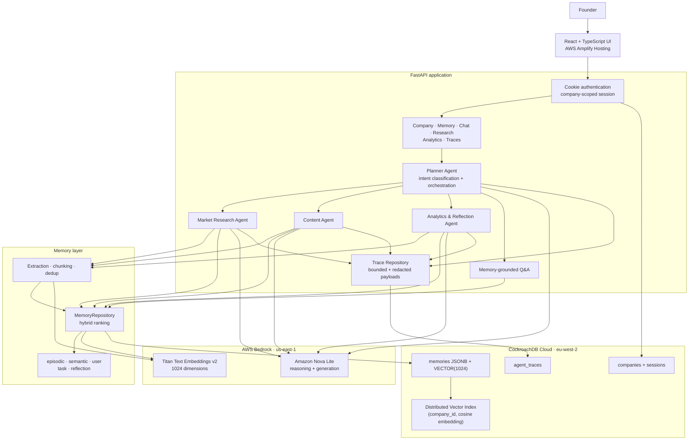

<div align="center">

# GrowthPilot

### A memory-first AI go-to-market teammate for early-stage founders

**Research → create → measure → reflect → remember → improve**

Built for the **CockroachDB × AWS AI Agent Hackathon 2026**


**[Live demo →](https://main.d36pjqo64zw93w.amplifyapp.com)**

</div>

## Live demo

| | |
|---|---|
| **Application** | https://main.d36pjqo64zw93w.amplifyapp.com |
| **API health** | https://growthpilot-cockroachdb-x-aws-hackathon.onrender.com/health |
| **API docs** | https://growthpilot-cockroachdb-x-aws-hackathon.onrender.com/docs |

The demo account is seeded with one founder's previous week of activity so the
memory loop has real history to retrieve. Credentials are supplied with the
hackathon submission rather than committed here.

> The backend runs on a free instance that sleeps after inactivity. The first
> request can take up to a minute while it wakes; hit `/health` first if the UI
> looks slow to load.

## Why GrowthPilot?

Founders repeatedly explain the same company context to disconnected tools:
their ideal customer, positioning, previous experiments, research, and what
worked last week. Conventional AI generation produces another isolated answer.

GrowthPilot turns that history into durable company memory. Specialized agents
retrieve relevant context before acting, persist useful results afterwards, and
make their memory provenance visible. A later content run can therefore use a
reflection learned from an earlier campaign instead of starting from scratch.

## The demo loop

1. A founder completes onboarding. Goals, customers, channels, and previous
   attempts become typed memories.
2. The Market Research Agent creates structured, deduplicated research memory.
3. The Planner routes a request to Research, Content, Analytics, or
   memory-grounded Q&A.
4. The Content Agent retrieves company context and produces a campaign asset.
5. The Analytics & Reflection Agent compares simulated LinkedIn performance,
   creates a cautious hypothesis, and saves it as `reflection` memory.
6. The next Content run retrieves that reflection. The UI shows exactly which
   memories were used.

> Campaign likes, comments, and clicks are explicitly simulated for the
> hackathon demo. GrowthPilot does not claim a live LinkedIn integration.

## Architecture

This diagram is the source-of-truth architecture for the hackathon build.



### Memory improvement loop


## What is implemented

| Capability | Implementation |
|---|---|
| Persistent memory | Five typed memory categories stored in CockroachDB |
| Semantic retrieval | Titan embeddings and CockroachDB cosine vector search |
| Hybrid ranking | Similarity combined with recency and importance |
| Tenant isolation | Every memory query is scoped by authenticated `company_id` |
| Onboarding | Company profile plus typed founder memories |
| Planner | Single, parallel, and dependency-aware sequential execution |
| Market Research | Bedrock- or user-source findings, structured and deduplicated |
| Content Generation | Memory-grounded marketing content persisted as task memory |
| Analytics & Reflection | Deterministic comparison plus Bedrock narrative and saved reflection |
| GrowthGraph | Synthetic 75-founder cohort plus a privacy-safe cross-tenant aggregate |
| Memory Inspector | Retrieved content, type, similarity, recency, and importance |
| Observability | Per-agent duration, success/error, output, and retrieved-memory traces |
| Authentication | Hashed credentials and secure company-scoped session cookies |
| Resilience | CockroachDB `40001` transaction retry and non-blocking trace failures |

### Honest scope boundary

- Market research is generated from the company profile or user-supplied source
  text; it is not a general-purpose web crawler.
- Analytics uses seeded, simulated LinkedIn performance.
- CRM automation, live social publishing, and autonomous paid campaigns are
  roadmap items, not current capabilities.
- Agent traces include real failed runs. We deliberately did not hide them: the
  error path is part of what we want reviewed.

## Why CockroachDB?

GrowthPilot needs relational integrity, JSON metadata, tenant-scoped access,
transactional writes, and semantic retrieval in the same durable system.
CockroachDB provides that without adding a separate vector database.

### Distributed Vector Indexing

Memories use `VECTOR(1024)` embeddings and cosine distance. The vector index is
prefixed by `company_id`:

```sql
VECTOR INDEX (company_id, embedding vector_cosine_ops)
```

The prefix both narrows the search space and enforces the query shape used for
tenant isolation. The index is only used when prefix columns are constrained to
exact values, so single-tenant retrieval uses `company_id = $1` and approved
cross-tenant aggregate work uses an explicit `company_id IN (...)` allowlist.
A range predicate silently drops the index and falls back to a full scan.

### Production-minded database behavior

- Full transactions retry on CockroachDB serialization error `40001`. Postgres
  defaults to `READ COMMITTED` and blocks on conflict; CockroachDB defaults to
  `SERIALIZABLE` and instead fails one of the conflicting transactions. `40001`
  is the database asking for a re-run, not an error condition — but the whole
  transaction has to be retried, because once it receives `40001` it is already
  aborted and retrying a single statement inside it fails again.
- Bedrock embedding calls happen outside retried transactions, so a retry never
  re-pays for inference.
- **Result portals are always drained.** asyncpg's `fetchval()`/`fetchrow()`
  bind a portal with a row limit of 1 and stop reading, leaving it suspended.
  CockroachDB v26.2 then rejects the next statement on that connection, which
  breaks every multi-statement transaction — including the write path that
  checks a content hash, looks for a semantic duplicate, then inserts. Enabling
  `multiple_active_portals_enabled` looks like the fix and is what the error
  message suggests, but it only narrows the failure: a suspended portal must
  then be a read-only `SELECT` with no sub-queries, which excludes
  `INSERT ... RETURNING` and every CTE in the memory layer. The real fix is to
  never suspend a portal, so the repository reads through helpers built on
  `fetch()` instead. This class of bug is invisible to unit tests that mock the
  connection; it only appears against a live cluster.
- Content hashes provide idempotent memory deduplication.
- JSONB stores typed provenance without fragmenting the memory table.
- Traces are bounded and recursively redact credentials, cookies, and tokens.

More detail is available in [`docs/memory.md`](docs/memory.md).

## Why AWS Bedrock?

GrowthPilot uses AWS Bedrock in `us-east-1` for two distinct jobs:

- **Titan Text Embeddings v2** creates 1024-dimensional memory embeddings.
- **Amazon Nova Lite** performs intent classification, research synthesis,
  content generation, and reflection writing.

The Analytics Agent calculates all engagement totals and averages in Python
before asking the model for a narrative. The LLM cannot silently change the
winning group or invent unsupported metrics.

### Why inference and storage are in different regions

The CockroachDB cluster is in `eu-west-2` (London) and Bedrock is in
`us-east-1`. That split is deliberate, not an oversight:

- Bedrock on-demand quota is granted per region. This account has none in
  `eu-west-2` or `eu-west-3` — both return `ThrottlingException` on a single
  cold request, which reads as a transient error but is not.
- Anthropic models on Bedrock are additionally gated behind a per-provider
  use-case approval, so switching between Claude versions does not help.
  Amazon Nova needs no such approval, and Nova Lite was accurate enough for
  every generation task in the loop.
- `us-east-1` rejects bare Anthropic model IDs for on-demand calls and requires
  an inference-profile ID (the `us.` prefix). Titan embeddings take a bare
  model ID. That asymmetry is easy to lose an hour to.

The cross-region hop costs roughly 100–150 ms per embedding call, which is an
acceptable trade for having inference at all. Both model IDs and the region are
read from the environment rather than hardcoded, so repointing is a
configuration change and not a redeploy.

## API surface

| Method | Endpoint | Purpose |
|---|---|---|
| `GET` | `/health` | Service health, including database connectivity |
| `POST` | `/api/auth/signup` | Create a company account |
| `POST` | `/api/auth/login` | Start a secure session |
| `POST` | `/api/auth/logout` | End the session |
| `GET` | `/api/company/me` | Current company profile |
| `POST` | `/api/company/onboarding` | Save profile and founder memories |
| `POST` | `/api/memory/search` | Tenant-scoped semantic memory search |
| `POST` | `/api/chat/stream` | Planner-orchestrated SSE response |
| `POST` | `/api/chat/generate-content` | Direct Content Agent compatibility route |
| `POST` | `/api/research/run` | Run Market Research |
| `GET` | `/api/research/memories` | Read saved research findings |
| `GET` | `/api/analytics/latest` | Read the newest saved analytics reflection |
| `POST` | `/api/analytics/reflection` | Analyze campaign memories and save a reflection |
| `POST` | `/api/growthgraph/insights` | Anonymised cross-founder aggregate |
| `GET` | `/api/traces` | Recent company-scoped agent traces |
| `GET` | `/api/traces/{trace_id}` | One trace with safe details |

`/health` returns `200` with `{"status": "degraded"}` rather than a `500` when
the database is unreachable, so "the service is down" and "the service is up
but its database is not" are distinguishable from the outside.

## Local setup

### Prerequisites

- Python 3.11+
- Node.js 22+
- A CockroachDB Cloud cluster with vector indexing enabled
- AWS credentials with Bedrock access in `us-east-1`

### 1. Install the backend

```bash
python -m venv .venv
source .venv/bin/activate
pip install -e ".[dev]"
cp .env.example .env
```

Fill in `DATABASE_URL` and the AWS settings in `.env`. Never commit that file.

### 2. Apply migrations

Migrations live in `backend/migrations/` and are numbered in apply order.

```bash
psql "$DATABASE_URL" -v ON_ERROR_STOP=1 -f backend/migrations/001_init.sql
psql "$DATABASE_URL" -v ON_ERROR_STOP=1 -f backend/migrations/002_auth.sql
# ...and so on, in order
```

`001_init.sql` enables CockroachDB vector indexing at the cluster level, so the
database user must be able to change that setting. Note also that the vector
index is declared inline in `CREATE TABLE`: adding one to a non-empty table
requires `SET sql_safe_updates = false` and blocks writes during backfill.

> `scripts/migrate.py` exists but has **no migration ledger** — it replays every
> file from `001` regardless of what has already been applied. Use it only
> against a database you are willing to rebuild, and prefer applying individual
> files to an existing cluster.

Verify the schema:

```bash
psql "$DATABASE_URL" -P pager=off -Atc "
SELECT table_name FROM information_schema.tables
WHERE table_schema='public' ORDER BY table_name;"
```

### 3. Seed the demo history

```bash
python scripts/seed_demo_founder.py          # one founder's previous week
python scripts/set_demo_credentials.py you@example.com   # make it loginable
```

The seed script writes through the memory layer, which means the company it
creates has no login credentials. `set_demo_credentials.py` attaches them using
the application's own password hashing so the stored hash matches what the
login route expects.

Both scripts are idempotent — re-running reports `reused` instead of inserting
duplicates, and does not re-pay for embeddings.

Optional, for the GrowthGraph cross-tenant view:

```bash
python scripts/seed_growthgraph_founders.py --count 50
```

That is 50 companies and roughly 250 embedding calls, so it takes a few minutes.

### 4. Start the API

```bash
uvicorn backend.main:app --reload --port 8000
```

### 5. Start the frontend

```bash
cd frontend
npm ci
npm run dev
```

Locally the session cookie must be `SESSION_COOKIE_SECURE=false` and
`SESSION_COOKIE_SAMESITE=lax`, because `localhost` is served over plain HTTP and
a `Secure` cookie is never stored there. The deployed values are different — see
below.

## Deployment

The demo runs on **AWS Amplify Hosting** for the frontend and **Render** for the
FastAPI backend, with **AWS Bedrock** providing all inference and **CockroachDB
Cloud** holding all state.

### Why the backend is not on AWS compute

- **AWS App Runner** stopped accepting new customers on 30 April 2026, so a new
  service cannot be created.
- **AWS Lambda** is the wrong shape: `/api/chat/stream` is server-sent events,
  and API Gateway does not proxy SSE cleanly.
- **ECS Express Mode**, the migration path App Runner points to, requires
  containerising the app; that was more change than the remaining time allowed.

The hackathon requirement is at least one AWS service. GrowthPilot uses two:
Bedrock for all model inference, and Amplify Hosting for the client.

### Backend — Render

| Setting | Value |
|---|---|
| Language | Python 3 |
| Build command | `pip install .` |
| Start command | `uvicorn backend.main:app --host 0.0.0.0 --port $PORT` |
| Health check path | `/health` |

Environment variables:

```bash
DATABASE_URL=postgresql://<user>:<password>@<host>:26257/defaultdb?sslmode=verify-full
AWS_ACCESS_KEY_ID=...
AWS_SECRET_ACCESS_KEY=...
AWS_REGION=us-east-1
AWS_DEFAULT_REGION=us-east-1
BEDROCK_EMBEDDING_MODEL=amazon.titan-embed-text-v2:0
BEDROCK_TEXT_MODEL=amazon.nova-lite-v1:0
LOG_LEVEL=INFO
SESSION_TTL_SECONDS=604800
SESSION_COOKIE_SECURE=true
SESSION_COOKIE_SAMESITE=none
FRONTEND_ORIGINS=https://<your-frontend-domain>
```

`AWS_REGION` configures the Bedrock client and is independent of the region the
container itself runs in. No CA certificate file is needed despite
`sslmode=verify-full`: the connection layer passes an explicit SSL context built
from the system trust store, and CockroachDB Cloud's certificate is publicly
signed.

`FRONTEND_ORIGINS` must be exact origins with no trailing slash. Cookie
authentication is incompatible with a wildcard CORS origin.

### Frontend — AWS Amplify Hosting

The repository is a monorepo, so set the app root to `frontend`. The build spec
is committed as [`amplify.yml`](amplify.yml).

Two hosting rules matter, both configured under **Rewrites and redirects**:

```json
[
  {
    "source": "/api/<*>",
    "target": "https://<your-backend-domain>/api/<*>",
    "status": "200"
  },
  {
    "source": "/<*>",
    "target": "/index.html",
    "status": "404-200"
  }
]
```

The first is a reverse proxy and is what makes authentication work in every
browser. With the frontend and backend on different registrable domains the
session cookie is a third-party cookie, which Safari blocks by default and
Chrome blocks in private windows — login appears to succeed and then every
subsequent request is a `401`. Proxying `/api/*` through the frontend origin
makes the cookie first-party and removes the CORS surface entirely. Leave
`VITE_API_BASE_URL` unset so the client issues same-origin relative requests.

The second rule is SPA deep-link handling: `404-200` serves `index.html` with a
`200` when a path does not match a build artifact. A plain `200` rewrite would
intercept static assets too.

Because Vite inlines environment variables at build time, changing any `VITE_*`
value requires a rebuild, not a restart.

## Tests

Pull-request CI runs everything that does not need external credentials:

```bash
ruff check backend
pytest backend/tests -q -m "not integration"
cd frontend && npm ci && npm run lint && npm run build
```

Real CockroachDB integration tests are intentionally separate:

```bash
pytest backend/tests -q -m integration
```

They require a valid `DATABASE_URL` and should only run in a trusted,
secret-backed environment.

## Repository map

```text
backend/
  agents/       Agent lifecycle, Planner, Research, Content, Analytics, traces
  api/          Authenticated FastAPI routes
  database/     asyncpg pool, 40001 retry wrapper, vector literal helpers
  llm/          Bedrock client (region and model IDs are environment-driven)
  memory/       Retrieval, ranking, extraction, chunking, dedup, persistence
  migrations/   CockroachDB schema, ordered
  tests/        Unit, API, resilience, and real-cluster integration tests
frontend/       Vite/React client
infra/          ccloud CLI wrapper and EXPLAIN ANALYZE notes
scripts/        Migrations, deterministic seeds, and demo runners
docs/           Memory design and API contracts
amplify.yml     Amplify Hosting build spec
```

## Security and privacy

- All company data is scoped from the authenticated session, not a client-
  supplied tenant ID.
- Session cookies are HTTP-only, with Secure and SameSite behaviour configured
  per environment.
- CORS uses explicit allowed origins when credentials are enabled.
- Login compares against a dummy hash when an email is unknown, so response
  time does not reveal which addresses are registered.
- Trace payloads redact sensitive keys and enforce size and depth limits.
- GrowthGraph responses return cohort aggregates only: no company IDs, memory
  IDs, founder names, or raw memory content.
- `.env`, certificates, and cloud credentials are never committed.

## How we collaborated

GrowthPilot was designed and built by a distributed team in a little over two
weeks. We used a shared Trello board as the project control plane:

**[View the GrowthPilot delivery board →](https://trello.com/b/HxZbXQSE)**

- Work was split into numbered, reviewable tickets spanning infrastructure,
  memory, agents, API contracts, frontend surfaces, testing, and deployment.
- Every ticket had a clear owner, checklist, dependency notes, and visible
  movement through **To-do**, **In progress**, **Blocked**, **Under review**,
  and **Done**.
- Cross-layer contracts — especially SSE events, memory provenance, reflection
  output, and tenant isolation — were agreed in ticket and PR discussions before
  the dependent work was merged.
- Contributors developed on focused branches and used pull requests for code
  review, automated tests, conflict resolution, and integration against the
  latest `main`.
- Blockers were made explicit rather than hidden. This let backend, frontend,
  data, and deployment work continue in parallel while dependencies were being
  resolved.

That workflow helped us turn many independently owned components into one
coherent demo loop while keeping the implementation and hackathon claims
reviewable by the whole team.

## Team

GrowthPilot was built collaboratively for the CockroachDB × AWS AI Agent
Hackathon 2026, spanning memory architecture, agent orchestration, frontend,
API design, testing, and deployment.

**Contributors (alphabetical order):**

- [Amaan](https://github.com/amaanofc)
- [Coral](https://github.com/cosmicoral)
- [Gagandeep Singh](https://github.com/gagan615)
- [Larry Margerum](https://github.com/larrymargerum01)
- [M Muneeb Hussain](https://github.com/muneeb0065)

## License

This project is available under the [MIT License](LICENSE).
